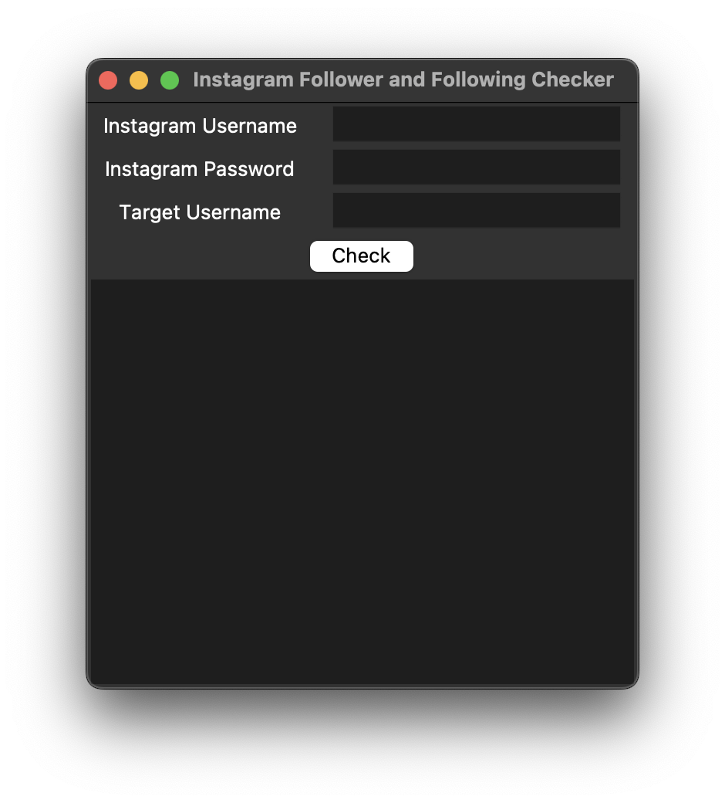

# Instagram User Insights

This is a Tkinter based desktop application that provides insights about an Instagram user.

## Table of Contents

- [Instagram User Insights](#instagram-user-insights)
  - [Table of Contents](#table-of-contents)
  - [Screenshots](#screenshots)
  - [Features](#features)
  - [Installation](#installation)
  - [Usage](#usage)
  - [Author](#author)

## Screenshots



## Features

- Analyze any Public/Private Instagram profile.
- Get insights about the user's followers.
- Get insights about the user's following.

## Installation

```bash
git clone https://github.com/mantreshkhurana/instagram-user-insights.git
cd instagram-user-insights
pip install -r requirements.txt
```

## Usage

```bash
python main.py
```

## Author

- [Mantresh Khurana](https://github.com/mantreshkhurana)
